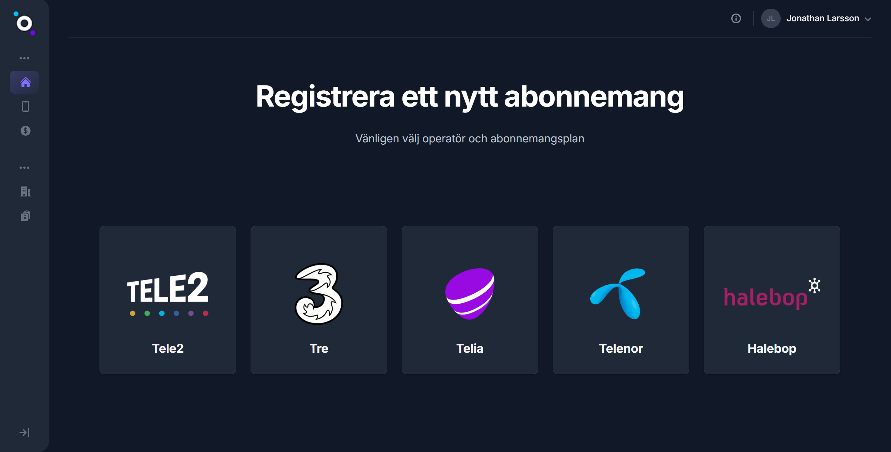
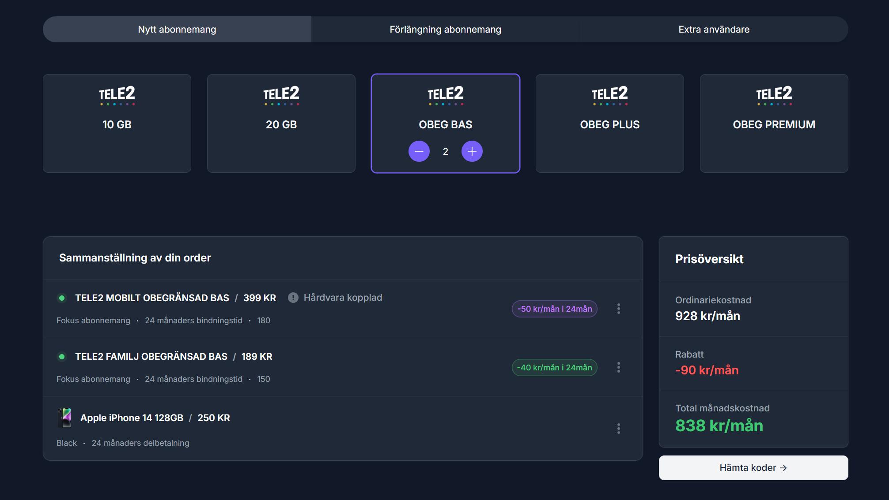

# Spotdeal – Telecom Subscription Sales Platform

<!-- > **NOTICE:** This is a portfolio project. Commercial use is strictly prohibited. See [LICENSE](LICENSE) for details. -->

## About the Project

Spotdeal is a sales enablement platform built to help telecom sales representatives increase subscription sales by providing instant access to operator pricing, subscription plans, and phone discounts across all carriers. The system enables sales teams to quickly compare offers and present the most compelling deal to each customer, transforming complex pricing calculations into a clear, consultative workflow. Every completed sale is registered and tracked through a real-time dashboard that displays sales trends, individual performance, and progress toward budget goals.

## 📸 Screenshots

### Sales Registration

> **[ADD SCREENSHOT HERE: Main dashboard showing sales statistics, charts, and performance metrics]**

> **[ADD SCREENSHOT HERE: Main dashboard showing sales statistics, charts, and performance metrics]**

### Dashboard View

> **[ADD SCREENSHOT HERE: Main dashboard showing sales statistics, charts, and performance metrics]**

## 🛠️ Tech Stack

**Backend**

- ASP.NET Core Web API (C#)
- Entity Framework Core
- SQL Server
- JWT Authentication

**Frontend**

- React + TypeScript
- Tailwind CSS
- Chart.js
- Axios

**Infrastructure**

- Azure App Service
- Azure SQL Database

## License

This project is licensed under **Creative Commons Attribution-NonCommercial-NoDerivatives 4.0 International** (CC BY-NC-ND 4.0).

**What this means:**

- ✅ You may view and study the code for learning purposes
- ✅ You may share links to this repository
- ❌ You may NOT use this code for commercial purposes
- ❌ You may NOT create or distribute modified versions
- ❌ You may NOT use this code in production environments

See the [LICENSE](LICENSE) file for complete terms.

---

_Developed independently as a portfolio project demonstrating full-stack SaaS development capabilities._

