

# Spotdeal – Telecom Subscription Sales Platform

> **NOTICE:** This is a portfolio project. Commercial use is strictly prohibited. See [LICENSE](LICENSE) for details.

## About the Project
Spotdeal helps salespeople find, compare, and sell the right mobile subscription in seconds, without switching between operator sites and spreadsheets. By gathering operator pricing, campaigns, and phone discounts in one workspace, salespeople can focus on the customer, not the calculation. Every order is tracked in real-time dashboards showing performance, budget progress, and sales trends.

## 📸 Screenshots

📊 <b>Dashboard</b>

 

### Sales Overview

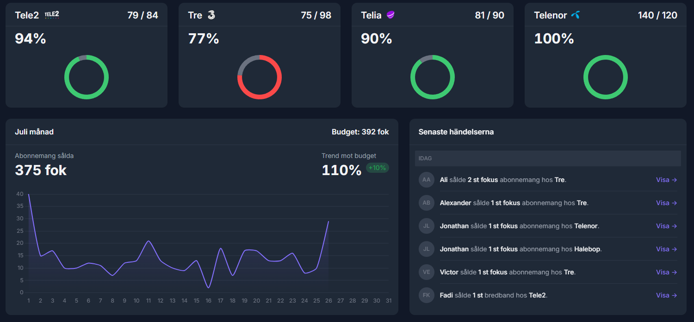

> _Sales progress by operator, daily trends, and recent orders_

---

### Individual Performance Table

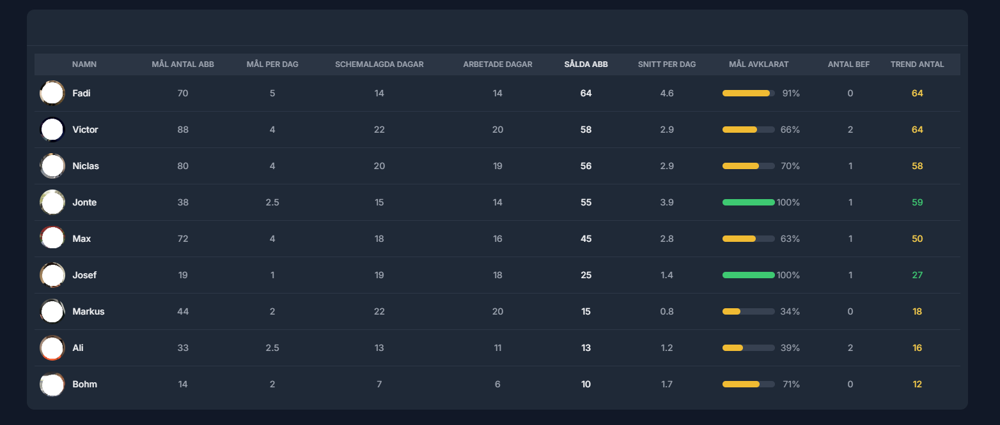

> _Sales rep performance with daily stats and goal progress_

---

📱 <b>Sales Registration</b>

 

### Step 1: Select Operator

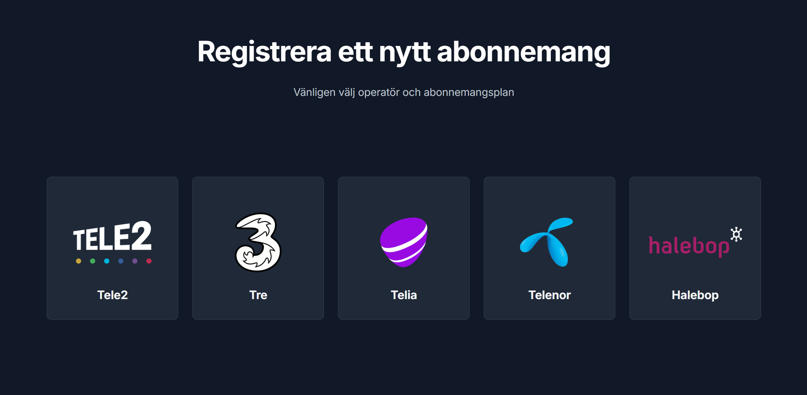

> _Choose operator to start sale registration_

---

### Step 2: Select Subscription

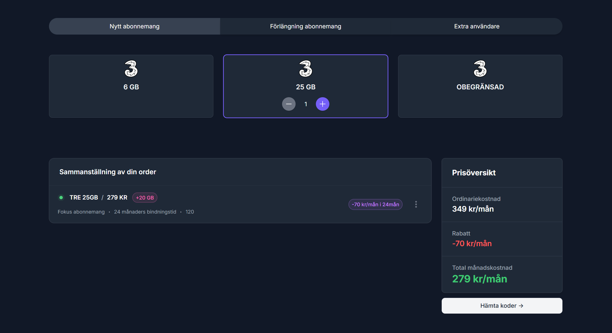

> _Select subscription plan and review order summary_

---

### Step 3: Add Phone

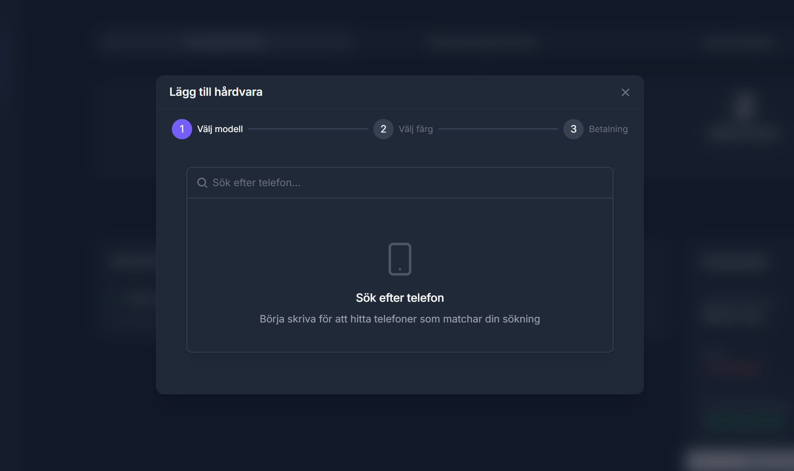

> _Search and select phone model_

---

### Step 4: Choose Phone

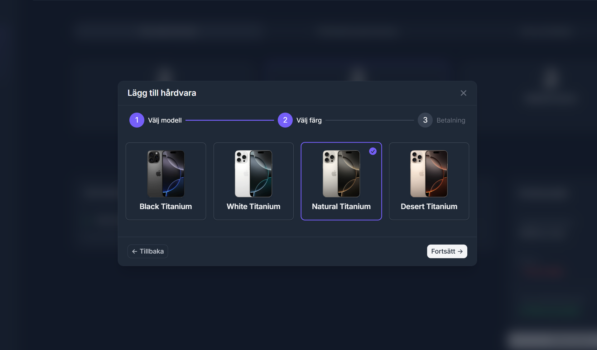

> _Pick phone color and continue to next step_

---

### Step 5: Add to Cart

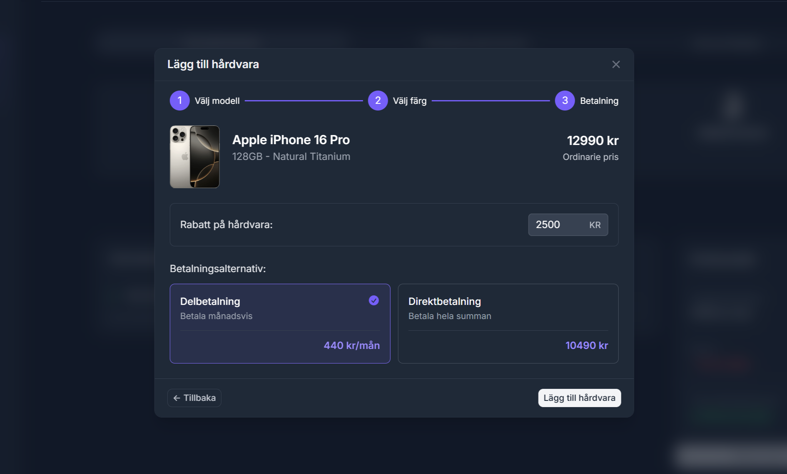

> _Set discount and payment method, then add phone to order_

---

### Step 6: Confirm Sale

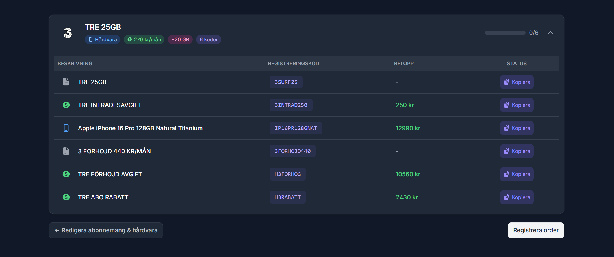

> _Review order details, copy codes, and register the sale_

---

### Step 7: Sale Confirmation

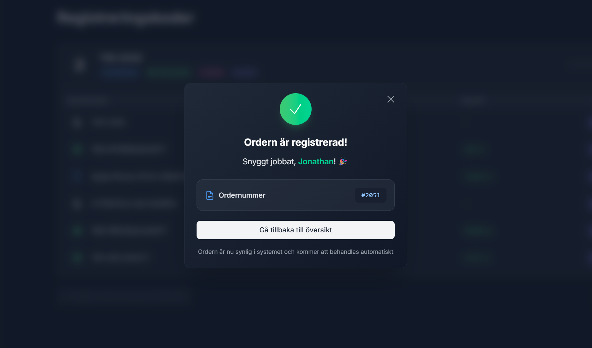

> _Order successfully registered with confirmation number_

---

🔍 <b>Price Comparison</b>

 

### Pricing Table

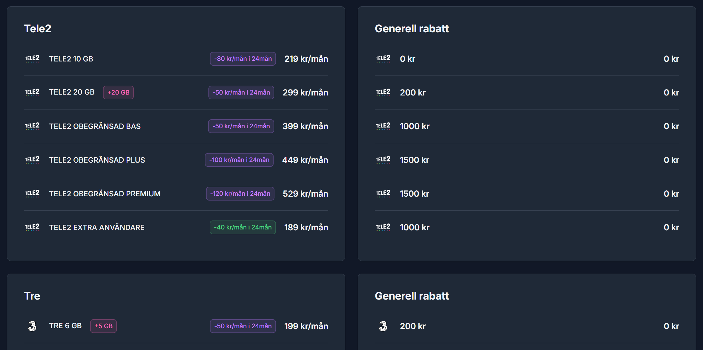

> _Quick reference table with subscription prices, discounts, and campaigns_

---

📦 <b>Order Management</b>

 

### Order History

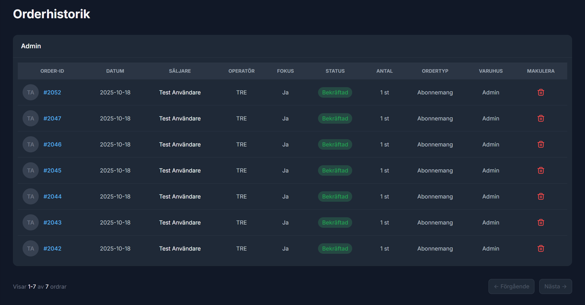

> _All registered orders with details and option to cancel_

---

### Cancel Order

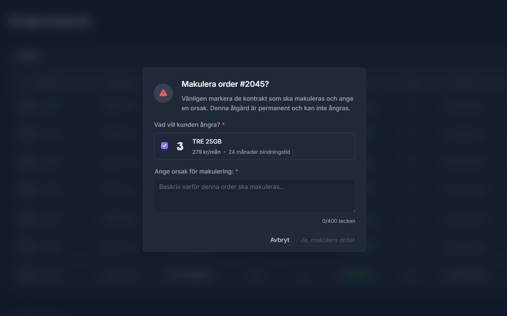

> _Select subscriptions to cancel, provide reason, and confirm cancellation_

---

## License

**CC BY-NC-ND 4.0** – This portfolio project is shared for educational purposes only.

You may view and reference the code, but commercial use, modifications, and redistribution are strictly prohibited. See [LICENSE](LICENSE) for full terms.

## License

Licensed under **CC BY-NC-ND 4.0** – shared for educational and portfolio purposes.

You may view and study the code, but commercial use, modifications, and redistribution are not permitted. See [LICENSE](LICENSE) for full terms.

## License

This project is licensed under **CC BY-NC-ND 4.0** and is available for educational review only.

Commercial use, derivative works, and redistribution are strictly prohibited. See [LICENSE](LICENSE) for complete terms.

---

_Developed independently as a portfolio project demonstrating full-stack SaaS development capabilities._

