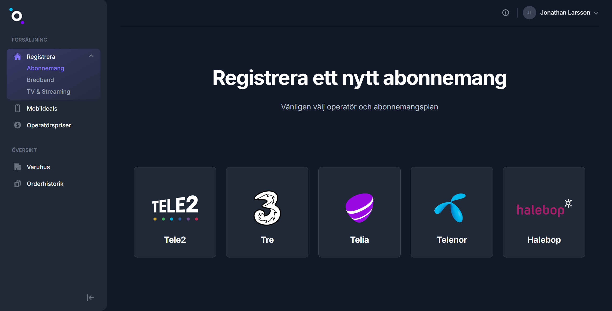

# Spotdeal – Telecom Subscription Sales Platform




> **NOTICE:** This is a portfolio project. Commercial use is strictly prohibited. See [LICENSE](LICENSE) for details.

## About the Project

Spotdeal is a sales enablement platform built to help telecom sales representatives increase subscription sales by providing instant access to operator pricing, subscription plans, and phone discounts across all carriers. The system enables sales teams to quickly compare offers and present the most compelling deal to each customer, transforming complex pricing calculations into a clear, consultative workflow. Every completed sale is registered and tracked through a real-time dashboard that displays sales trends, individual performance, and progress toward budget goals.

## Core Functionality

### Sales Flow

1. **Registration:** Sales representatives log sold subscriptions with a few clicks
2. **Data Capture:** System stores salesperson, subscription details, operator, timestamp
3. **Analytics:** Real-time dashboard displays sales statistics per salesperson and operator
4. **Order Management:** Full CRUD operations including order cancellation for customer returns

### Key Features

- ✅ Fast subscription registration interface
- ✅ Mobile deal search and filtering
- ✅ Real-time sales dashboard with statistics
- ✅ Sales performance tracking per employee
- ✅ Operator-specific analytics
- ✅ Order management with cancellation support
- ✅ Transaction history and audit trail
- ✅ User authentication and authorization
- ✅ Responsive design for desktop and mobile use

## Technical Stack

### Backend

- **Framework:** C# ASP.NET Core REST API
- **Database:** SQL Server
- **ORM:** Entity Framework Core
- **Architecture:** RESTful API design
- **Authentication:** JWT-based authentication

### Frontend

- **Framework:** React
- **Styling:** Tailwind CSS
- **Charts/Visualization:** Chart.js
- **State Management:** React Hooks
- **API Communication:** Axios/Fetch

### Data Model

- Users (Sales representatives, Managers, Admins)
- Subscriptions (Product catalog)
- Operators (Mobile carriers)
- Transactions (Sales records)
- Sales statistics and aggregations

## System Architecture

```
┌─────────────────┐
│  React Frontend │
│  (Tailwind CSS) │
└────────┬────────┘
         │ HTTPS/REST
         ▼
┌─────────────────┐
│   ASP.NET API   │
│  (C# REST API)  │
└────────┬────────┘
         │ EF Core
         ▼
┌─────────────────┐
│   SQL Server    │
│   (Database)    │
└─────────────────┘
```

## Screenshots

### Dashboard View

_Real-time sales statistics and performance metrics_

### Subscription Registration

_Quick and intuitive interface for logging sales_

### Analytics

_Detailed breakdown by salesperson and operator using Chart.js visualizations_

## Technical Highlights

- **Performance Optimized:** Efficient database queries with Entity Framework
- **Scalable Architecture:** RESTful API design supports future expansion
- **Security:** Role-based access control and secure authentication
- **Responsive Design:** Works seamlessly on desktop and mobile devices
- **Data Integrity:** Transaction management ensures consistent data state
- **Modern UI/UX:** Clean interface built with Tailwind CSS components

## Development Approach

This project demonstrates:

- Full-stack development capabilities (C# backend + React frontend)
- Database design and ORM implementation
- RESTful API architecture and best practices
- Modern frontend development with React and Tailwind
- Data visualization with Chart.js
- User authentication and authorization
- CRUD operations and business logic implementation
- Solo project management and execution

## Use Cases

**For Sales Representatives:**

- Quick subscription registration during customer interactions
- Search available mobile deals
- View personal sales history

**For Management:**

- Monitor real-time sales performance
- Track individual salesperson metrics
- Analyze operator-specific trends
- Generate sales reports

**For Administrators:**

- User management
- Subscription catalog maintenance
- Operator pricing updates
- System configuration

## License

This project is licensed under **Creative Commons Attribution-NonCommercial-NoDerivatives 4.0 International** (CC BY-NC-ND 4.0).

**What this means:**

- ✅ You may view and study the code for learning purposes
- ✅ You may share links to this repository
- ❌ You may NOT use this code for commercial purposes
- ❌ You may NOT create or distribute modified versions
- ❌ You may NOT use this code in production environments

See the [LICENSE](LICENSE) file for complete terms.

---

_Developed independently as a portfolio project demonstrating full-stack SaaS development capabilities._
