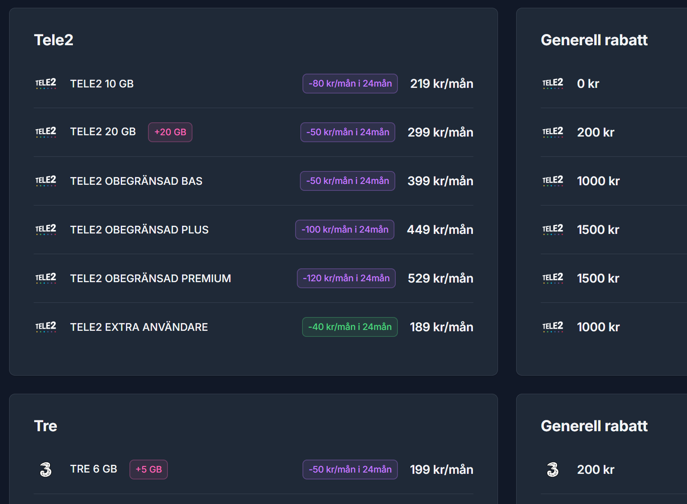
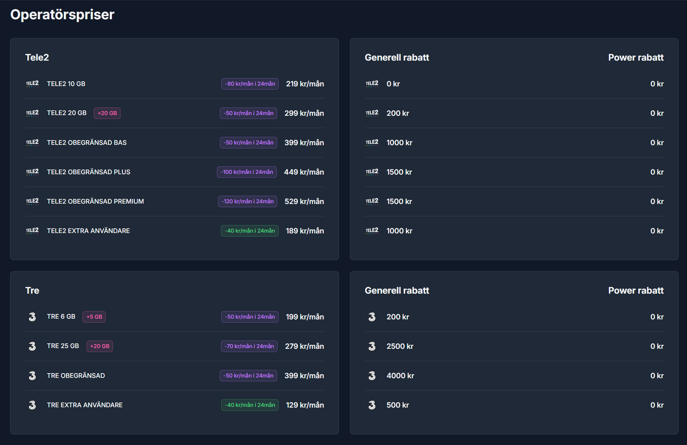
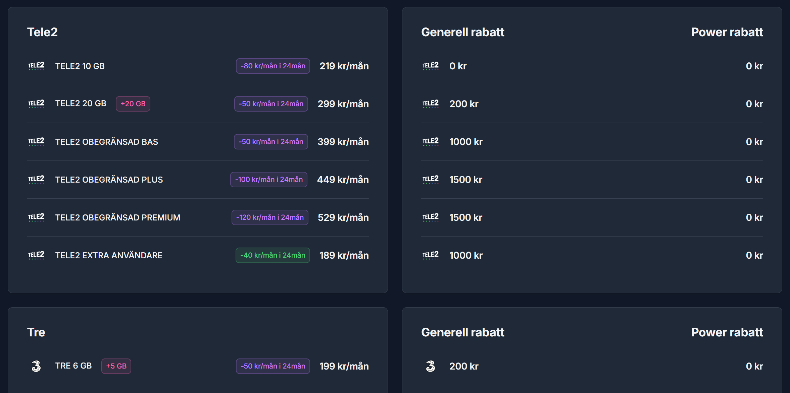

# Spotdeal – Telecom Subscription Sales Platform

> **NOTICE:** This is a portfolio project. Commercial use is strictly prohibited. See [LICENSE](LICENSE) for details.

## About the Project

Spotdeal is a sales enablement platform built to help telecom sales representatives increase subscription sales by providing instant access to operator pricing, subscription plans, and phone discounts across all carriers. The system enables sales teams to quickly compare offers and present the most compelling deal to each customer, transforming complex pricing calculations into a clear, consultative workflow. Every completed sale is registered and tracked through a real-time dashboard that displays sales trends, individual performance, and progress toward budget goals.

## 📸 Screenshots

📊 <b>Dashboard</b>

 

### Sales Overview

_Real-time statistics showing total sales, revenue, and trends_

---

### Individual Performance

_Individual and team performance tracking_

📱 <b>Sales Registration</b>

 

### Step 1: Select Operator

_Sales rep selects the operator for the subscription_

---

### Step 2: Select Subscription

_Choose the subscription plan sold to the customer_

---

### Step 3: Add Phone

_Select phone model and view available discounts_

---

### Step 4: Choose Phone

_Select phone color and storage variant_

---

### Step 5: Add to Cart

_Review selected items with calculated discounts_

---

### Step 6: Confirm Sale

_Confirm details and register the completed sale_

---

### Step 7: Sale Confirmation

_Success message with order summary and receipt_

📖 <b>Sales Cheat Sheet</b>

 

### Subscription Overview

_Quick reference guide showing all subscriptions with pricing, discounts, and active campaigns_

---

### Subscription Overview

_Quick reference guide showing all subscriptions with pricing, discounts, and active campaigns_

---

### Subscription Overview

_Quick reference guide showing all subscriptions with pricing, discounts, and active campaigns_

📋 <b>Order Management</b>

 

### Order History

_Overview of all recent orders with customer, operator, and sales rep information_

---

### Cancel Order

_Click the 🗑️ icon to cancel/void an order for customer returns_

## ⚡ Key Features

- **Instant Sales Registration** – Log completed subscriptions in seconds
- **Smart Pricing Tools** – Compare operator plans and device discounts across all carriers
- **Real-Time Analytics** – Track sales trends, individual performance, and budget progress
- **Interactive Dashboards** – Visualize sales data with Chart.js
- **Order Management** – Full CRUD operations with cancellation support
- **Role-Based Access** – Secure JWT authentication for reps and managers

## 💡 The Problem It Solves

Sales reps struggle to quickly compare subscription plans and calculate device discounts across multiple carriers. Spotdeal transforms complex pricing into instant, compelling customer offers.

**Example:** A customer paying 399 kr/month can be shown a better deal at 299 kr/month with 1,000 kr off their device—calculated in seconds. This consultative approach increases conversion rates while helping teams hit their targets.

## License

This project is licensed under **Creative Commons Attribution-NonCommercial-NoDerivatives 4.0 International** (CC BY-NC-ND 4.0).

**What this means:**

- ✅ You may view and study the code for learning purposes
- ✅ You may share links to this repository
- ❌ You may NOT use this code for commercial purposes
- ❌ You may NOT create or distribute modified versions
- ❌ You may NOT use this code in production environments

See the [LICENSE](LICENSE) file for complete terms.

---

_Developed independently as a portfolio project demonstrating full-stack SaaS development capabilities._

