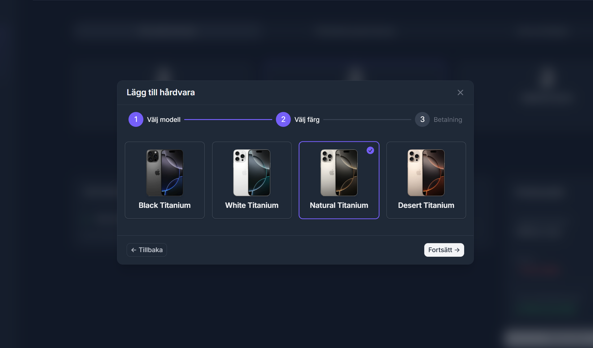
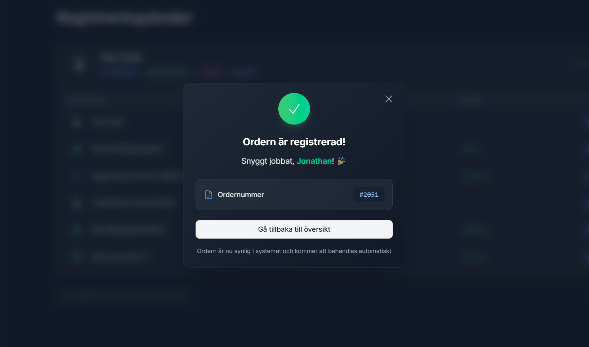
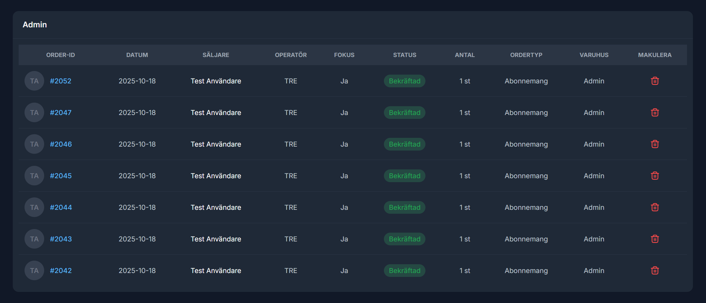

# Spotdeal – Telecom Subscription Sales Platform

> **NOTICE:** This is a portfolio project. Commercial use is strictly prohibited. See [LICENSE](LICENSE) for details.

## About the Project

Spotdeal helps telecom retailers find, compare, and sell the right mobile subscription in seconds, without switching between operator sites and spreadsheets. By gathering operator pricing, campaigns, and phone discounts in one workspace, sales staff can focus on the customer, not the calculation. Every order is tracked in real-time dashboards showing performance, budget progress, and sales trends.

## Features

### 🔐 Authentication & Security

- Azure AD authentication via MSAL (Microsoft Authentication Library)
- User validation against SQL database for access control
- JWT Bearer token authorization for all API requests
- Role-based access control with user levels (Sales, Manager, Admin)

### 🏢 Multi-tenancy

- Designed for large retail chains with multiple stores
- Data isolation at both company level and store level
- Automatic data filtering based on user context

### 🛠️ Tech & Infrastructure

- **Frontend:** React (TypeScript, TailwindCSS, Vite)
- **Backend:** ASP.NET Core, Entity Framework
- **Database:** Microsoft SQL Server
- **Hosting:** Azure App Service & Azure SQL

### 🚀 Core Functionality

- Track sales progress and staff performance in real-time
- Compare subscription pricing and discounts across all operators
- Register sales through guided step-by-step workflow
- View complete order history and cancel registrations when needed

## Screenshots

📊 <b>Dashboard</b>

 

### Sales Overview

> _Sales progress by operator, daily trends, and recent orders_

---

### Individual Performance Table

> _Sales staff performance with daily stats and goal progress_

---

📱 <b>Sales Registration</b>

 

### Step 1: Select Operator

> _Choose operator to start sale registration_

---

### Step 2: Select Subscription

> _Select subscription plan and review order summary_

---

### Step 3: Add Phone

> _Search and select phone model_

---

### Step 4: Choose Phone

> _Pick phone color and continue to next step_

---

### Step 5: Add to Cart

> _Set discount and payment method, then add phone to order_

---

### Step 6: Confirm Sale

> _Review order details, copy codes, and register the sale_

---

### Step 7: Sale Confirmation

> _Order successfully registered with confirmation number_

---

🔠<b>Price Comparison</b>

 

### Pricing Table

> _Quick reference table with subscription prices, discounts, and campaigns_

---

📦 <b>Order Management</b>

 

### Order History

> _All registered orders with details and option to cancel_

---

### Cancel Order

> _Select subscriptions to cancel, provide reason, and confirm cancellation_

---

## License

Licensed under **CC BY-NC-ND 4.0** – shared for educational and portfolio purposes.

You may view and study the code, but commercial use, modifications, and redistribution are not permitted.   See [LICENSE](LICENSE) for complete terms.

---

_Copyright © 2025 Jonathan Larsson_

